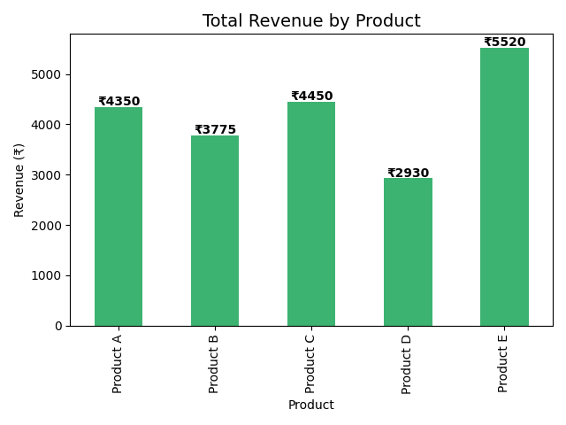
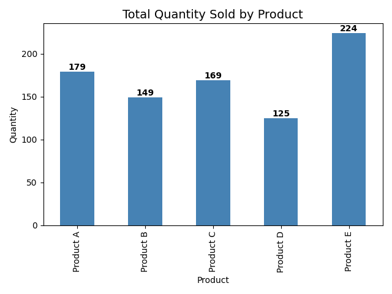
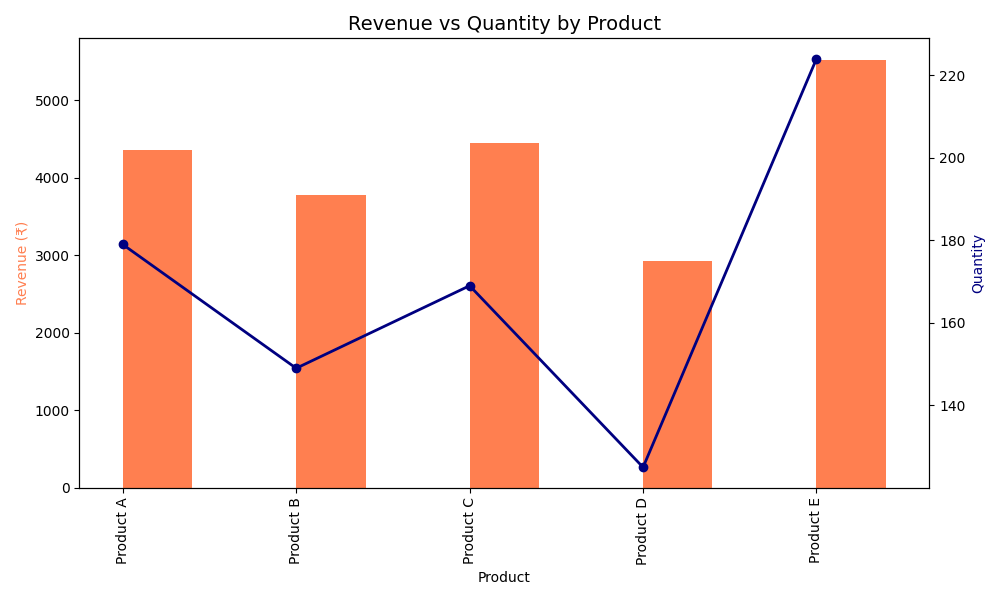
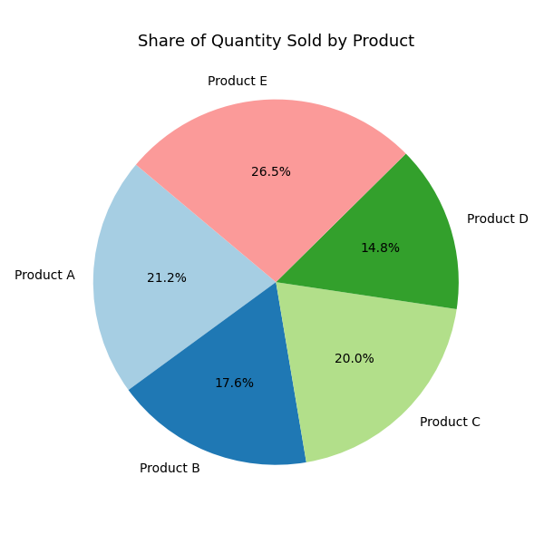

## 📊 Sales Data Visualization with SQLite and Python

This project demonstrates how to:

* Create a **SQLite database** with sample sales data
* Use **SQL inside Python** to extract total quantity sold and revenue per product
* Load and analyze data with **Pandas**
* Create multiple **visualizations** using **Matplotlib**

---

### 🧾 Features

* SQLite database with `sales` table (50+ rows)
* SQL query to aggregate quantity and revenue per product
* Python + Pandas for data loading and manipulation
* Matplotlib visualizations:

  * Bar chart: **Total Revenue by Product**
  * Bar chart: **Total Quantity by Product**
  * Combined chart: **Revenue vs Quantity**
  * Pie chart: **Quantity Share per Product**
* All charts saved as `.png` images

---

### 🗃️ Tech Stack

| Tool       | Purpose                        |
| ---------- | ------------------------------ |
| Python     | Programming Language           |
| SQLite3    | Lightweight SQL database       |
| Pandas     | Data analysis and manipulation |
| Matplotlib | Data visualization library     |

---

### 📂 Project Structure

```
sales_data_project/
│
├── sales_data.db                    # SQLite database file
├── sales_visualization.py          # Main Python script
├── final_revenue_by_product.png    # Revenue bar chart
├── final_quantity_by_product.png   # Quantity bar chart
├── final_revenue_vs_quantity.png   # Revenue vs Quantity (bar + line)
├── final_quantity_pie_chart.png    # Pie chart of quantity share
└── README.md                       # Project documentation
```

---

### 🧑‍💻 How to Run

1. **Clone or download this repo**

2. **Install Python dependencies**

```bash
pip install pandas matplotlib
```

3. **Run the Python script**

```bash
python sales_visualization.py
```

This will:

* Create `sales_data.db` (if not exists)
* Insert 50+ random sales records
* Query and analyze data
* Generate and save 4 charts as PNG files

---

### 📈 Example Sales Summary Output

| Product   | Total Quantity | Total Revenue (₹) |
| --------- | -------------- | ----------------- |
| Product A | 109            | ₹2735.0           |
| Product B | 116            | ₹3020.0           |
| Product C | 126            | ₹3280.0           |
| Product D | 84             | ₹1745.0           |
| Product E | 146            | ₹3325.0           |

---

### 📊 Sample Visuals

#### ✅ Revenue by Product



#### ✅ Quantity by Product



#### ✅ Revenue vs Quantity



#### ✅ Quantity Share



---

### 🔧 Customization Ideas

* Add `date` column and analyze **monthly trends**
* Export results to **Excel or PDF**
* Add **interactive charts** using Plotly
* Use a **real dataset** instead of random generation

---

### 👨‍💻 Author

**Shubham S**
📧 Email: [10221shubham.s@gmail.com](mailto:10221shubham.s@gmail.com)
🔗 [LinkedIn](https://www.linkedin.com/in/shubham-s-14ba6a283/)
🐙 [GitHub](https://github.com/shubh-2601s)

---

### 📜 License

This project is open-source and free to use for educational purposes.

---

